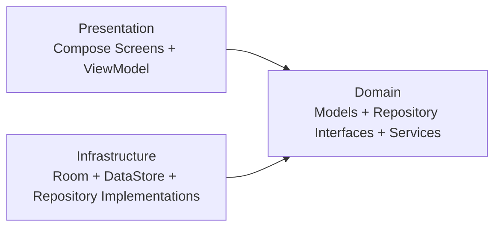

# Nurtur (FeedTracker)


Nurtur is an Android baby feeding tracker that helps parents quickly log feeds, monitor milk intake and waste, and review trends over time.

## Context

- **Platform:** Android
- **Language:** Kotlin
- **UI:** Jetpack Compose + Material Design 3
- **Local Storage:** Room
- **State Management:** ViewModel + Coroutines/Flow
- **Settings Storage:** DataStore (Preferences)
- **Architecture:** DDD-leaning layers (`presentation` -> `domain` -> `infrastructure`)
- **Future Plan:** Firebase Firestore sync (Phase 2) through repository abstraction

## Prerequisites

- Android Studio (latest stable recommended)
- Android SDK 34
- JDK 17
- Gradle 8.x

## Quick Start

1. Open this folder in Android Studio.
2. Let Gradle sync the project.
3. Run the `app` configuration on an emulator/device.

If you prefer CLI and have Gradle available:

```bash
gradle :app:assembleDebug
```

## Current MVP Features

- Home tab with:
  - Left-aligned app title and decorative profile icon
  - Time since last feed hero card with status badge (On track / Approaching / Overdue)
  - Daily snapshot metric cards (consumed ml, wasted ml, feed count)
- Recent feed activity list (latest 30)
  - Tap any recent entry to edit it
  - Milk-type icon tiles with clean-feed / wasted status labels
  - No swipe-delete gesture on Home (delete remains explicit in editor flow)
- Log Feed bottom sheet with:
  - Date/time pickers for start and end time
  - Offered/consumed inputs in ml with enforced validation
  - Read-only dynamic wasted milk calculation
  - Segmented milk type selection (Formula/Breastmilk)
  - Optional notes
  - Edit mode with Save Changes and explicit Delete Feed action
  - Validation that keeps sheet open on invalid input
- Analytics tab:
  - Top app bar and inline 7D/14D/30D quick filter chips
  - Last 7 days grouped summary (consumed, wasted, feed count)
- Settings tab:
  - Sectioned cards for Feeding Defaults, Reminders, Appearance, and Data (v2 placeholders)
  - Default bottle size (ml) and segmented default milk type
  - Reminders: default feed interval slider (hours), push notifications toggle, quiet hours window
  - Theme segmented control (System/Light/Dark)
- Home next-alert chip:
  - Shows calculated next feed alert after a feed is logged
  - Inline EDIT overrides the upcoming alert only (does not change the global interval)

## Architecture Overview



## Documentation Workflow

Use `PROJECT_KNOWLEDGE.md` as the persistent prompt/feature memory file.

When adding or changing a feature, update both:

1. `README.md` -> `Current MVP Features` and any setup changes.
2. `PROJECT_KNOWLEDGE.md` -> requirement log, design decisions, and prompt context.

## Common Issues

- **Gradle command not found:** use Android Studio bundled Gradle, or install Gradle locally.
- **SDK mismatch errors:** confirm Android SDK 34 and JDK 17 are selected in Android Studio.
